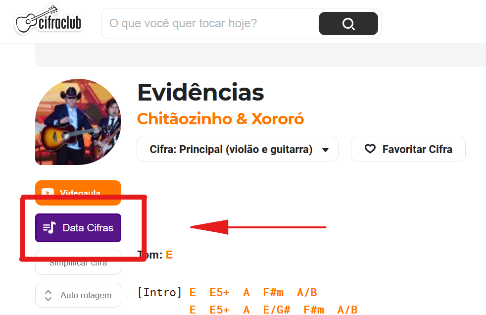
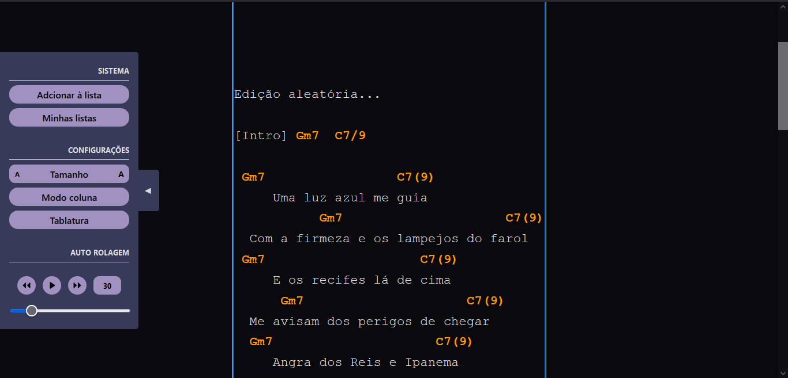
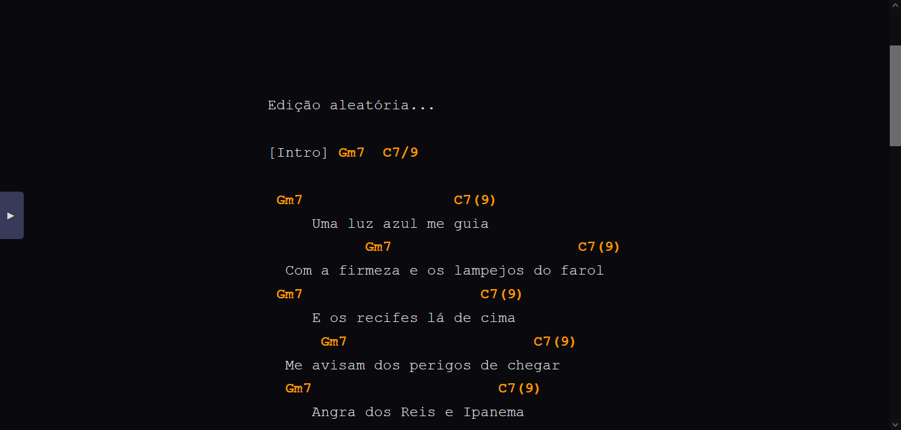
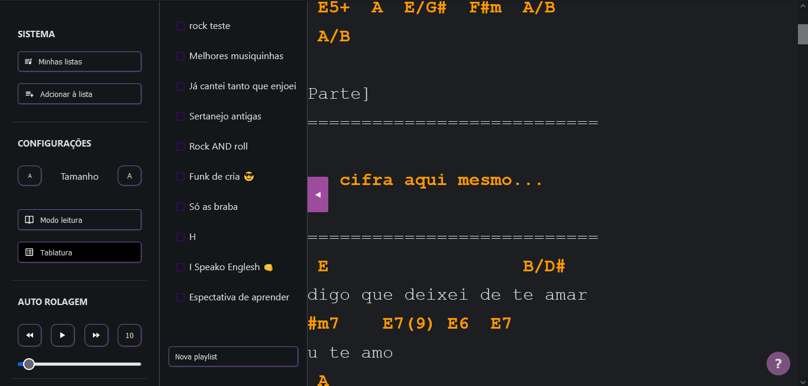
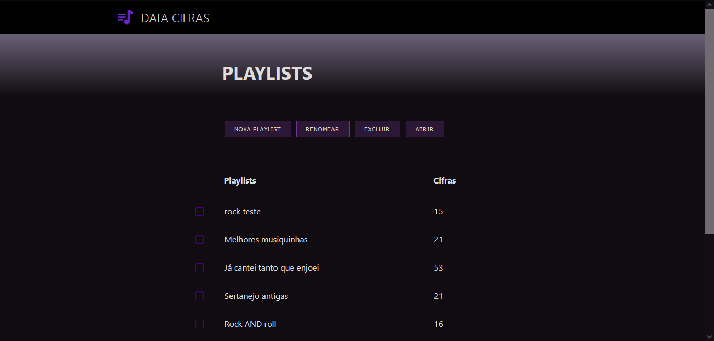

# Data cifras

Extensão para Chrome e Firefox que serve como uma extensão ao [cifra club](https://www.cifraclub.com.br). A Data cifra permite que você salve, edite e categorize as cifras, além de trazer várias ferramentas que ajudam a visualizar toda a cifra em quanto toca a musica.

<br>

### Utilize o botão acionado no menu mais a esquerda extrair a cifra do cifra club



<br>

### Edite a cifra de acordo com as suas preferências e utilize o funcionalidades do menu



<br>

### No modo leitura fica mais fácil de visualizar a cifra em tela cheia e navegar pelo texto. Nesse modo, é possível controlar toda a visualização a partir de atalhos de teclado.



<br>

### Adicione as cifras em playlists customizadas e gerencie as playlists e as cifras





<br>

# "Banco de dados" 😎

O sistema de banco de dados é uma implementação JavaScript de um sistema relacional básico que armazena dois tipos de objetos: playlists e ciphers. Os dados são armazenados diretamente na API de armazenamento da extenção ``browser.storage.local`` e o "relacionamento" entre as tabelas é um array de id que corresponde ao ID da outra tabela.

Em um exemplo, esse sistema many-to-many funciona da seguinte forma: ao adicionar uma cifra em uma playlists, o id da playlist é adicionado no objeto cifra em playlists: []. Da mesma forma que o id da cifra é adcionado no objeto playlist em ciphers: [].

Com o objetivo de evitar bugs no banco de dados, todas as alterações são feitas em variáveis locais que correspondem a uma cópia do armazenamento original carregadas ao construir a classe ``this.ciphers; this.playlists; this.target``. Sempre que a alteração é completa (ex: createCipher()), os dados passam por uma verificação dos tipos dos dados e o relacionamento entre as tabelas. No caso dos dados não passarem na verificação ou no caso de algum erro inesperado, o sistema retorna carrega os ultimos dados salvos na API do browser e reinicia a classe.

```
playlist = {
   id: uniqueString
   title: string
   ciphers: id[]
}
cipher = {
   id: uniqueString
   title: string
   code: string
   playlists: id[]
   settings: { fontSize: float, tablatura: boolean, scrollSpeed: int }
}
target = cipher id
```

